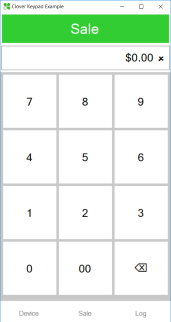
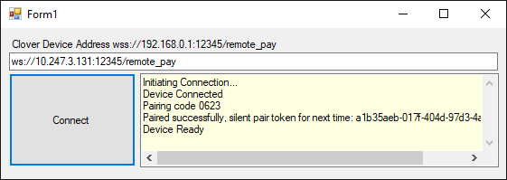

# Clover, Inc. Remote Pay Windows Examples
[Clover Windows Examples](https://github.com/clover/remote-pay-windows-examples) &bull; [Clover Windows SDK](https://github.com/clover/remote-pay-windows) &bull; [Clover, Inc](https://clover.com)

## Samples

### SalesKeypad
A simple calculator-style sales app to take sales with a Clover Device. Source code demonstrates how simple a sale end-to-end flow can be.

Similar to the Clover iOS Keypad Example, this example shows a very simple sale transaction flow in context of a touchscreen-friendly calculator. It also shows how simple copy and paste of a sale total amount from another application can work as the simplest of integrations. 

Open project file _SalesKeypad\SalesKeypad.sln_ or see [github releases](https://github.com/clover/remote-pay-windows-examples/releases) for a download-and-run version.

### SnpdConnectionExample
A simple Secure Network Pay Display (SNPD) / WebSocket Transport connection example using the CloverEventConnector convenience wrapper.

This example shows the simplest WebSocket Transport / SNPD connection to a device with no extra features to disguise the connection code. It uses the 

Open project file _SnpdConnectionExample\SnpdConnectionExample.sln_ .